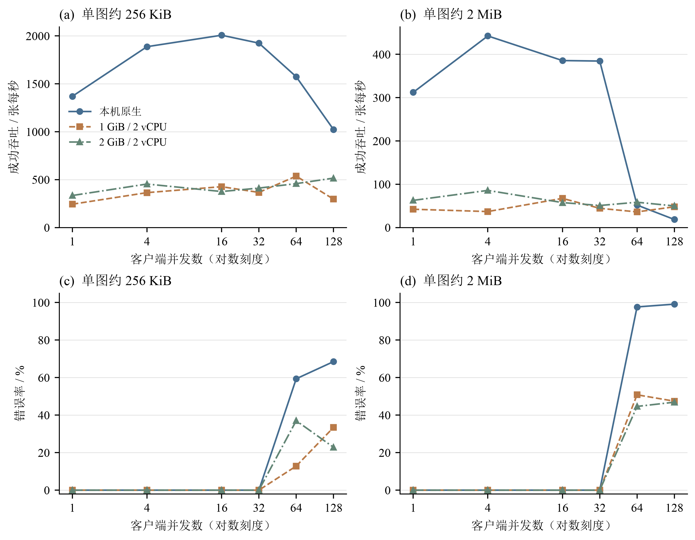
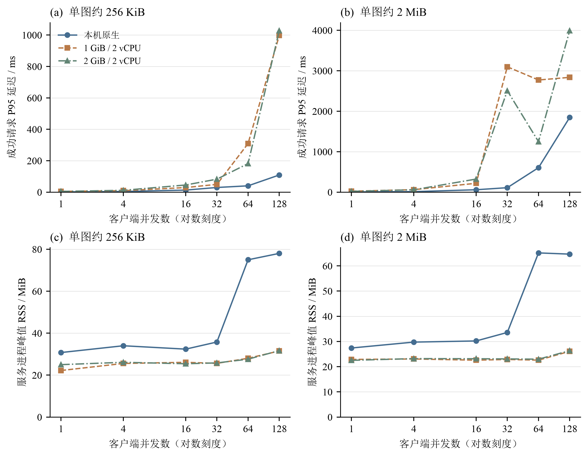
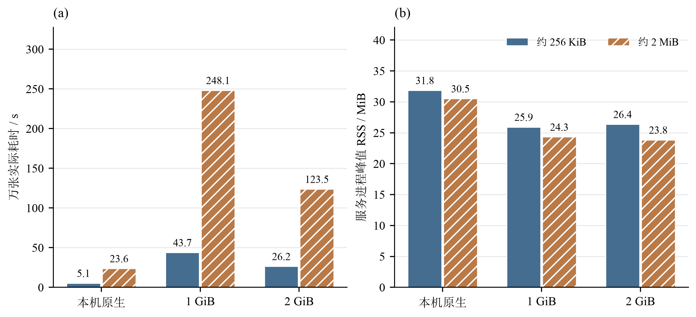
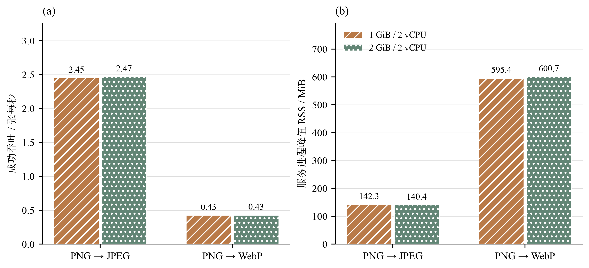
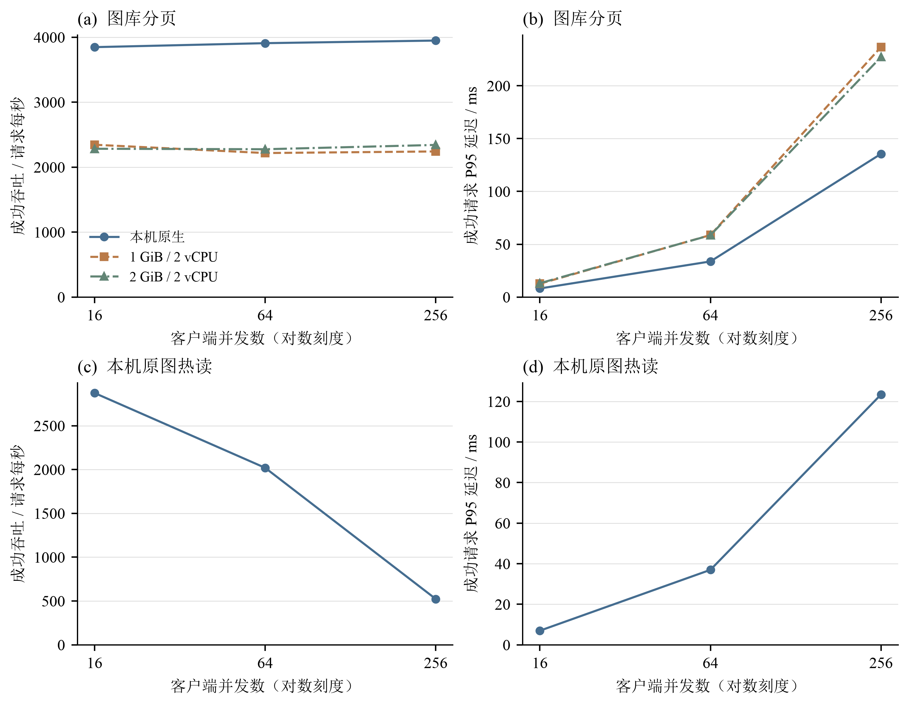

# 性能测试报告（2026-09-25）

[返回 README](README.md) · [原始记录与测量口径](docs/benchmarks/README.md)

## 结论摘要

- 默认关闭图片转换、4 路上传时，1 GiB / 2 vCPU 容器实测上传万张约 2 MiB 图片耗时 **248.1 秒**，2 GiB 容器为 **123.5 秒**；六组万张测试均无错误。
- 盲目增加并发会带来排队和拒绝：64/128 路上传已出现明显错误，应从 4 路开始。
- 接近 800 万像素的 WebP 转换达到约 **600 MiB RSS**，吞吐约 **0.43 张/秒**，与普通上传的资源需求显著不同。
- 以下是本机与本机 Docker 容器测量，**不是 Zeabur 或公网部署性能保证**。

## 环境与方法

测试业务版本 `292fd2b`。本机 Apple M4 Pro / 14 核 / 24 GiB，macOS + 本地 APFS；客户端与生产服务分进程运行。1 GiB、2 GiB 场景使用 Docker Desktop Linux arm64 的实际容器硬限制，均为 **2 vCPU、禁用容器 swap、本地匿名卷**。容器网络和存储经过虚拟机，不能将其与原生差距全部归因于内存，也不能当作 Zeabur 实机数据。

API Key 上传有效随机像素 PNG，每张约 256 KiB 或 2 MiB；默认关闭压缩/转换、无客户端重试。每组新库，并发表示在途请求数而非在线用户数；依次测试 1/4/16/32/64/128 个闭环客户端，各发送 8 秒并等待收尾。**成功吞吐仅计完整收到 HTTP 200 的请求，429 和传输错误均不计入。**

## 上传峰值与过载边界



**图 1：上传并发对成功吞吐与错误率的影响。** 两列分别为约 256 KiB 和 2 MiB 图片；点表示实际测量，连接线只辅助观察。横轴采用以 2 为底的对数刻度，错误包括 HTTP 拒绝及传输/响应读取失败。64/128 路的过载结果完整保留。[矢量 PDF](docs/benchmarks/figures/upload_concurrency.pdf)



**图 2：上传延迟和内存随并发变化。** P95 仅统计成功响应，因此过载时较低的 P95 不代表整体服务体验改善。RSS 是服务进程驻留内存，不是 Go 堆或容器总内存。[矢量 PDF](docs/benchmarks/figures/upload_latency_memory.pdf)

下表取各环境、各图片大小的“本轮零错误最高吞吐”，是短测观测值，不是长期稳定性保证。RSS 只统计服务进程，不含客户端；原生为每 100 ms 采样，容器为内核记录的进程高水位。

| 环境 | 单图 | 峰值客户端并发 | 成功张/秒 | 成功 MiB/s | P95 延迟 | 服务 RSS 峰值 | 万张估算 |
| --- | --- | ---: | ---: | ---: | ---: | ---: | ---: |
| 本机原生 | 256 KiB | 16 | 2007.2 | 502.7 | 13.0 ms | 32.4 MiB | 5.0 秒 |
| 本机原生 | 2 MiB | 4 | 442.5 | 884.7 | 12.2 ms | 29.8 MiB | 22.6 秒 |
| 1 GiB / 2 vCPU | 256 KiB | 16 | 426.3 | 106.8 | 29.3 ms | 26.1 MiB | 23.5 秒 |
| 1 GiB / 2 vCPU | 2 MiB | 16 | 67.4 | 134.8 | 219.0 ms | 22.6 MiB | 148.4 秒 |
| 2 GiB / 2 vCPU | 256 KiB | 4 | 454.0 | 113.7 | 11.7 ms | 26.1 MiB | 22.0 秒 |
| 2 GiB / 2 vCPU | 2 MiB | 4 | 85.8 | 171.5 | 58.6 ms | 23.2 MiB | 116.6 秒 |

- 所测环境在 1–32 路上传均未出现 HTTP/传输错误；32 路不是推荐并发，也不是物理极限。处理槽固定为 **4 个执行 + 32 个等待**，等待槽不增加实际处理能力。
- 本机小图 4 → 16 路从 1,887.5 提升至 2,007.2 张/秒，仅增加约 6.3%，P95 从 4.1 ms 升至 13.0 ms；大图 4 路最快。通常从 **4 路**开始，按实机测量调整。
- 64/128 路属于过载：本机错误率约 59%–99%，容器约 13%–51%；提高并发可能使成功吞吐反而下降。本机部分请求已落库但客户端未完整确认，直接重传可能产生重复图片。429 应遵守 `Retry-After` 退避，不要无限堆积请求。

## 10,000 张实际批量上传



**图 3：4 路并发上传 10,000 张的实际耗时与 RSS。** 两种图片大小使用颜色和纹理区分；六组均成功完成 10,000 张。容器均为 2 vCPU，原生为本机环境；柱图基线为零。[矢量 PDF](docs/benchmarks/figures/batch_upload.pdf)

固定 **4 路并发**，每组完整上传 10,000 张，没有重试。以下六组均 **0 错误、落库 10,000 条、SQLite 检查正常**，时间为实测，不是短测折算。CPU 数值只统计服务进程/容器消耗，不是压测客户端或 Docker Desktop 整台虚拟机的总占用；1.0 表示约占满一核。

| 环境 | 单图 | 实际耗时 | 平均张/秒 | 服务 RSS 峰值 | 平均 CPU 核数 |
| --- | --- | ---: | ---: | ---: | ---: |
| 本机原生 | 256 KiB | 5.1 秒 | 1956.4 | 31.8 MiB | 2.57 |
| 本机原生 | 2 MiB | 23.6 秒 | 424.1 | 30.5 MiB | 3.27 |
| 1 GiB / 2 vCPU | 256 KiB | 43.7 秒 | 228.9 | 25.9 MiB | 0.15 |
| 1 GiB / 2 vCPU | 2 MiB | 248.1 秒 | 40.3 | 24.3 MiB | 0.18 |
| 2 GiB / 2 vCPU | 256 KiB | 26.2 秒 | 381.1 | 26.4 MiB | 0.21 |
| 2 GiB / 2 vCPU | 2 MiB | 123.5 秒 | 80.9 | 23.8 MiB | 0.27 |

两种容器限制下，所测普通上传均达到“10 分钟万张”；这不构成公网部署保证。完整批次会经历文件缓存回收，不能只依据 8 秒峰值安排持续批量任务。

## 1 GiB / 2 GiB 的容量解释

这里的限制是应用容器内存，不是整台服务器总内存。整机只有 1 GB/2 GB 时，还需扣除操作系统、Docker、代理等占用；本测试也没有模拟 Zeabur 共享 CPU 或网络限额。

普通上传并发阶梯中，1 GiB 容器服务进程 RSS 最高约 31.5 MiB，2 GiB 约 31.7 MiB，均未发生 OOM。Linux cgroup 总内存包含文件页缓存，1 GiB 场景会触及限额并回收缓存，不能把它解释为 Go 堆占满。RSS 较低也不意味着可以无限增加连接数；代码中的处理队列、磁盘持续写入与网络仍限制吞吐。更大内存不会自动增加上传处理槽。

## 接近像素上限的转换压力



**图 4：约 800 万像素图片的转换吞吐与 RSS。** JPEG 使用 20 秒发送窗口，WebP 使用 30 秒发送窗口，均计入请求收尾时间；这里没有采用另两组各 4 张的 WebP 短样本。两面板分别表示吞吐和内存，不能与小尺寸普通上传直接比较。[矢量 PDF](docs/benchmarks/figures/conversion_pressure.pdf)

使用 2828×2828（7,997,584 像素，源 PNG 约 30.5 MiB）的随机图片，接近代码的 800 万像素转换上限，4 路客户端。JPEG 发送窗口 20 秒，WebP 持续窗口 30 秒，均等待已发请求完成；各组 0 错误、无 OOM。WebP 另有每组 4 张的短样本，原始记录一并保留。

| 容器限制 | 转换 | 完成张数 | 成功张/秒 | P95 延迟 | 服务 RSS 峰值 |
| --- | --- | ---: | ---: | ---: | ---: |
| 1 GiB / 2 vCPU | PNG → JPEG | 52 | 2.45 | 1.72 秒 | 142.3 MiB |
| 2 GiB / 2 vCPU | PNG → JPEG | 53 | 2.47 | 1.62 秒 | 140.4 MiB |
| 1 GiB / 2 vCPU | PNG → WebP | 16 | 0.43 | 10.12 秒 | 595.4 MiB |
| 2 GiB / 2 vCPU | PNG → WebP | 16 | 0.43 | 10.02 秒 | 600.7 MiB |

转换只有一个执行槽，用于控制解码/编码像素缓冲区的内存。**1 GiB 在本轮样本中可运行，但 WebP 大图转换明显挤占内存余量；2 GiB 提供更多余量，吞吐却没有随之翻倍。** 这两类大图转换均达不到 16.67 张/秒，不能按普通流式上传推算“10 分钟万张”。未测所有格式、图片内容和长时间混合负载，595–601 MiB 不是严格的最坏内存上界。

## 图库与原图读取



**图 5：图库分页及原图热缓存读取。** 图库为 1,000 张图片中的第一页 50 条；原图仅测试原生环境反复读取同一张约 2 MiB 图片。所有读取组零错误；原图 256 路存在较长收尾，吞吐按实际完成耗时计算。[矢量 PDF](docs/benchmarks/figures/read_concurrency.pdf)

图库预置 1,000 张公开图片，查询第一页 50 条；分别测试 16/64/256 路，各发送 8 秒。原图下载仅测试本机重复读取同一张约 2 MiB 图片的热缓存路径。所有读取组均 0 错误，下表取各工作负载观测到的最高成功吞吐。

| 环境 | 工作负载 | 客户端并发 | 成功请求/秒 | P95 延迟 | 服务 RSS 峰值 |
| --- | --- | ---: | ---: | ---: | ---: |
| 本机原生 | 图库分页 | 256 | 3948.0 | 135.6 ms | 47.7 MiB |
| 1 GiB / 2 vCPU | 图库分页 | 16 | 2344.3 | 12.6 ms | 23.6 MiB |
| 2 GiB / 2 vCPU | 图库分页 | 256 | 2341.6 | 227.3 ms | 35.9 MiB |
| 本机原生 | 原图热读 | 16 | 2873.2 | 7.0 ms | 33.2 MiB |

原图热读峰值约 5746 MiB/s，仅反映本机缓存/回环上界；256 路时因收尾长尾，成功吞吐降至约 523 次/秒。这不是全图库冷读、百万记录图库或混合读写压力的结论。图库 16 路通常已接近本轮峰值，提高到 256 路主要增加等待延迟。

## 10 分钟上传 10,000 张需要什么

目标至少为 `10000 / 600 = 16.67 张/秒`。忽略协议开销，单图 256 KiB 需要约 **4.17 MiB/s（35 Mbit/s）**有效上行；单图 2 MiB 需要约 **33.33 MiB/s（280 Mbit/s）**。100 Mbit/s 上行传 10,000 张 2 MiB 图片，理论上至少约 **28 分钟**，即使服务端足够快也无法达到 10 分钟目标。

本机 HTTP 回环不包含公网 TLS、代理、CDN 和远程磁盘；测试写入也不是每张图片原文件都执行 `fsync` 后的断电持久性基准。请根据平均图片大小、真实上行和目标机器重新测量。

详细原始记录、计算口径和测试局限见 [性能测量记录](docs/benchmarks/README.md)，可复现工具见 [tools/loadtest](tools/loadtest/README.md)。汇总命令：

```bash
python3 tools/loadtest/summarize.py
```

## 图表复现与字体

图表由 [plot_results.py](tools/loadtest/plot_results.py) 直接读取原始 JSONL 生成，不重跑压测、不修改原始记录。共 60 组有效记录；主图使用 58 组，另两组 WebP 短样本保留在原始数据中。每个条件只有一次观测，未绘制无法从现有数据估计的误差棒或置信区间。

在仓库根目录执行（Python 3.11+）：

```bash
python3 -m venv /tmp/tanoimg-plot-venv
/tmp/tanoimg-plot-venv/bin/pip install -r tools/loadtest/requirements-plot.txt
MPLCONFIGDIR=/tmp/tanoimg-mpl /tmp/tanoimg-plot-venv/bin/python tools/loadtest/plot_results.py
```

需要本机已安装合法授权的 **SimSun（宋体）** 和 **Times New Roman**。若字体尚未被发现，可向脚本传入 `--simsun /path/to/simsun.ttc --times /path/to/times.ttf`。脚本缺少指定字体时会报错，不会静默替换字体；字体文件不随仓库分发。

中文采用宋体，英文和普通数字采用 Times New Roman；图表使用白底、细线，曲线结合线型与点型、柱图结合纹理，使灰度阅读也能区分系列。输出为 400 dpi PNG 与嵌入字体的矢量 PDF；[生成记录](docs/benchmarks/figures/manifest.json) 保存原始数据 SHA-256、字体名称和绘图库版本。Markdown 正文的字体由阅读器控制，上述字体约定适用于嵌入图表。

### 图表验收

- 原始记录的成功吞吐、错误率计算校验通过，万张批次完整性断言通过。
- 5 张 PNG 的彩色及灰度预览已检查，无文字裁切；系列可通过点型、线型或纹理区分。
- 5 份 PDF 经 `pdffonts` 检查，均嵌入 `SimSun` 与 `TimesNewRomanPSMT` 子集；转换图 PDF 已栅格化复查，与 PNG 一致。
- 全部图中文字已执行字形覆盖检查，生成日志无缺字警告；报告及 README 的本地链接检查通过。
